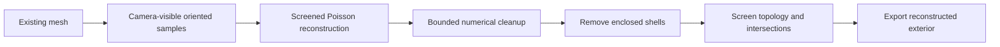

# Astra Forge — Exterior Screened Poisson Repair for ComfyUI

**v0.4.1 · public beta · MIT-licensed authored code**

Reconstruct a closed exterior from camera-visible surface samples, remove enclosed shells, and keep a practical amount of miniature detail. This is the successful exterior Poisson path from Astra Forge's mesh-cleanup development. It does not use the earlier binary-voxel filling or skin/core Boolean experiments.

## Quick start

1. Install this folder as `ComfyUI/custom_nodes/astra_exterior_poisson`.
2. Install `requirements.txt` with **the Python that runs ComfyUI**. Do not reinstall Torch.
3. Copy `examples/Astra_Demo_Open_Skin.glb` into `ComfyUI/input/3d/`.
4. Restart ComfyUI and load `workflow/Astra_Exterior_Poisson_Demo.json`.
5. Queue the workflow. The result saves under `ComfyUI/output/3d/Astra_Exterior_Poisson...glb`.

The demo is a synthetic, approximately 40 mm sphere with surface ridges, an opening, and an internal shell. It is included for installation testing, not as a miniature-quality benchmark.

**Already using the development `astra_trusted_surface` pack?** It already registers the same capture, reconstruction and report node IDs. Use its v0.4.1 implementation with the **From_MESH** workflow. The standalone demo uses a new file-loader node available only in this public pack. Do not load both packs at once. This standalone release omits the earlier experimental nodes and does not modify your original Astra mesh tools.

See [installation](docs/INSTALLATION.md), [working settings](docs/SETTINGS.md), [compatibility](docs/COMPATIBILITY.md), and [troubleshooting](docs/TROUBLESHOOTING.md).

## How it works



Capture retains the original mesh as a ray occluder and records visible patches with outward-oriented normals and confidence. Reconstruction uses those oriented samples to fit a continuous adaptive surface. It then cleans numerical defects and removes whole enclosed components after topology/intersection screening. Passing outputs contain no detected open boundaries, nonmanifold edges/vertices, duplicate/degenerate faces, winding conflicts, self-intersections, or nested shells.

This is **not exact original-face preservation**. Fine details can soften, missing areas are inferred, and legitimate openings can close. Separate exterior pieces are retained and may need trimming, attachment, or supports. `UNKNOWN` is the expected report status after successful numerical screening; it is not a printability certificate. Detected failures block export.

## Connect your own model

For files, place a GLB, GLTF, OBJ, STL or triangle-mesh PLY under `ComfyUI/input`, then enter its relative path in **Load Exterior Mesh**, for example `3d/my_miniature.glb`.

For an existing mesh-generation workflow, load `workflow/Astra_Exterior_Poisson_From_MESH.json` and connect your generator or cleanup node's **MESH** output to Capture. This integration workflow intentionally has an unconnected mesh input until you connect it.

The development benchmark used the already-cleaned output of:

`raw Pixal3D/Trellis mesh → Remesh → Decimate → Exterior Visibility → Local Repair → Shell Polish → Capture → Poisson → Save 3D`

Those upstream nodes are optional integration examples, not dependencies of this standalone release. The user supplied a baseline GLB for testing; the same settings are not a guarantee for every raw generator output. This pipeline is generator-independent once given a compatible triangular MESH.

## Recommended working preset

| Capture setting | Value |
|---|---:|
| `units_to_mm` | Calibrate to the source; see below |
| `view_directions` | 48 |
| `grid_resolution` | 2048 |
| `sample_spacing_mm` | 0.03 |
| `depth_epsilon_mm` | 0.01 |
| `max_samples` | 2,000,000 **ray probes** |
| `memory_budget_mb` | 4096 |

Capture's bottom **settings** text box:

```json
{"sampling_mode":"area_budgeted","target_patches":500000}
```

| Poisson setting | Value |
|---|---:|
| `octree_depth` | 10 |
| `point_weight` | 16 |
| `min_confidence` | 0.5 |
| `threads` | 8 |

**Four probes are needed per patch.** `max_samples=300000` means at most 75,000 patches, not 300,000 patches. Actual patch capacity is also limited by the source/BVH memory estimate. See the report's sampling budget and exterior-sample count.

Scale is `intended height in millimeters ÷ actual source height on the upright axis`. Use **1** for a file already expressed in mm (including the demo). A roughly unit-height normalized 40 mm miniature uses approximately **40**. A base can change normalized figure height, so inspect the loader's bounds. Geometry is exported in its original coordinate scale; set the desired physical height in your slicer. Height and thickness are not inferred from file names.

## Observed results and limits

On the supplied approximately 40 mm baseline miniature, 500,000 requested patches produced 284,737 accepted exterior samples. Capture, depth-10 reconstruction and screening took about 65 seconds in the tested environment. The result had 922,652 faces and five retained exterior components; six enclosed shells were removed, with zero measured geometry failures. This is one example, not a speed guarantee.

In a 10,000-point area sample of the reconstructed surface, the median nearest-original-triangle distance was 0.00094 mm and the 95th percentile 0.01605 mm. This one-way measurement does not certify every feature; larger changes occurred in inferred regions. The developer also found little visible improvement from 750,000 patches or point weight 24 after correcting the ray budget. Start with the working preset rather than raising every setting.

The full development suite passed 56 tests before packaging. This standalone package has its own focused tests and install check; see [verification](docs/VERIFICATION.md). All processing runs locally. No models, private character meshes, or generation prompts are included.

## Files

- `__init__.py`: focused capture/reconstruction/report kernels and input-file loader.
- `web/reports.js`: local report display.
- `workflow/`: visual workflows and a separately labeled API prompt.
- `examples/`: synthetic demo input.
- `INSTALL_WINDOWS.ps1`: installer for an explicit ComfyUI directory.
- `tools/check_install.py`: dependency/API check and optional demo reconstruction.
- `tests/`: focused offline regression tests.
- `GITHUB_RELEASE_POST.md`: ready-to-use release text.
- `MANIFEST.json`: SHA-256 hashes of packaged files.

MIT applies to the authored code and documents. Third-party dependencies are installed separately and retain their upstream licenses; see [third-party notes](docs/THIRD_PARTY.md).
